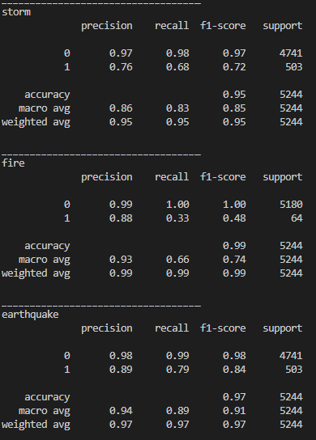
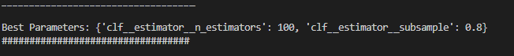
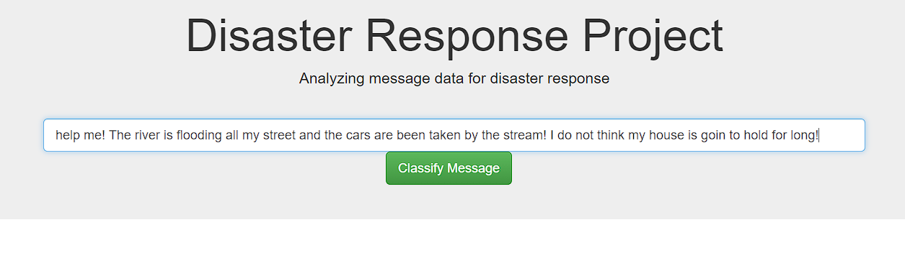
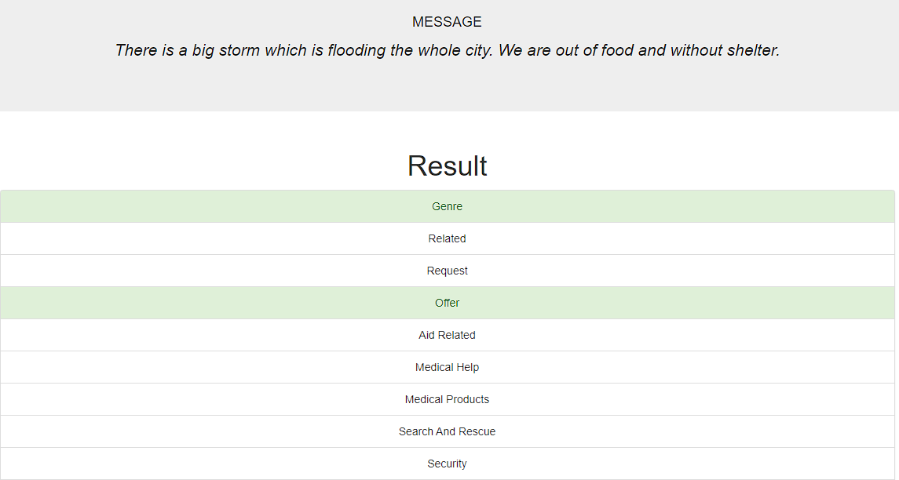
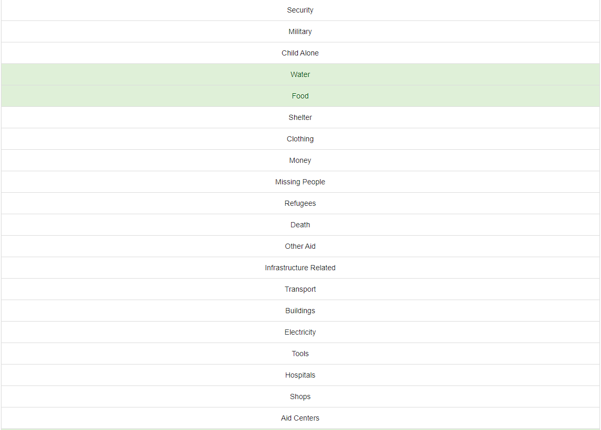
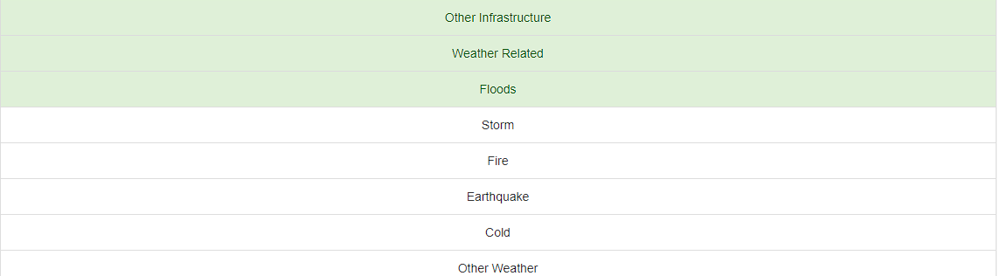

# Disaster Response Pipeline
In this project, a full data pipeline is created in order to prepare text data for Machine Learning through NLP. The text data machine learning pipeline to categorize these events so that you can send the messages to an appropriate disaster relief agency

## Project Components
There are three components you'll need to complete for this project.

1. **ETL Pipeline**
Data cleaning pipeline in a Python script (`process_data.py`) that:
* Loads the messages and categories datasets
* Merges the two datasets
* Cleans the data
* Stores it in a SQLite database

2. **ML Pipeline**
Machine Learning pipeline in a Python script (`train_classifier.py`) that:
* Loads data from the SQLite database
* Splits the dataset into training and test sets
* Builds a text processing and machine learning pipeline
* Trains and tunes a model using GridSearchCV
* Outputs results on the test set
* Exports the final model as a pickle file

3. **Flask Web App**
Web app as interface for the user to be able to interact with the project artefacts.


## How to use
The project was taught to be reusable, so that if someone in the future comes with a revised or new dataset of messages, they should be able to easily create a new model just by running the code. These Python scripts are able to run with additional arguments specifying the files used for the data and model.

### Inputs
* **messages dataset** in a `CSV` file.
* **categories dataset** in a `CSV` file.
* **SQLite's DB Name** as an arbitrary `str`
* **Model training hyperparameters for grid search** as a `JSON` file in the `data/models/in` folder


### Format of each dataset
The **categories dataset** should contain two columns: `id` and `categories`. The `id` column is a `int` type column and should correspond to the `id` column from the **messages dataset**, of which we are goiong to talk more later.The column `categories` should be a `str` type column with each label separated through a `;` and each result sepparated through a `-`, as following
```csv
related-1;request-0;offer-0;aid_related-0;medical_help-0;medical_products-0;search_and_rescue-0
```
The **messages dataset** consists of at leas two columns: `id:int` and `message:str`. The `message` column is the base for the NLP pipeline and input for the ML model training. It should consist of a message in *english* and should have a respective row of labels on the **categories dataset** with the same `id`.

### Prepare Data: ETL Pipeline
To prepare the data the script `src/models/process_data.py` should be run with some defined inputs.
1. Name of one `CSV` file as the **messages dataset**, that should be stored in the `data/01_raw` folder as first argument.
2. Name of one `CSV` file as the **categories dataset**, that should be stored in the `data/01_raw` folder as second argument.
3. Name of the SQLite DB which is going to be created as output of the data processing pipeline

> **Example of running the ETL pipeline**: `python process_data.py messages.csv categories.csv DisasterResponse.db`

### Train Model: ML Pipeline
To train the model the script `src/models/train_classifier.py` should be run with the name of the SQLite DB which is going to serve as data input.

> **Example of running the ML pipeline**: `python train_classifier.py DisasterResponse.db params.json`

After the model is trained it passes through an automatic evaluation process and for each category a `classification report` is printed, as follows:



Another printed output are the best hyperparameters obtained through the grid search, as follows:



Those are outputs generated for each model and after the whole training, there is a summary report of which  obtained f1-score. That serves as indicator of which model should be the best option for beeing used in the Web App.
he output looks like follows:

**ADD PICTURE HERE**


### Run the Web App
In the first approach the Web App is thaught to run locally, therefore the script `src/app/run.py` should be run.
the default *host* is the `'0.0.0.0'`, and default *port* the `3000`.

Once the Web App is running, it works just like:
1. Enter the message which you are willing to classify


2. The Web App is going to use the saved model to predict the classes of this input message




The classes which the model recognizes that are related to the messages are marked in green, which in the example make quite sense.

## Notes to mension: Dataset imbalance
There are some categories like **ADD CATEGORIES HERE** that are very inbalanced compared to another. It makes that the training process is more difficult for these classes, since there are few examples for the algorithm to generalize. The features that show poorest performance are the ones with the most imbalance